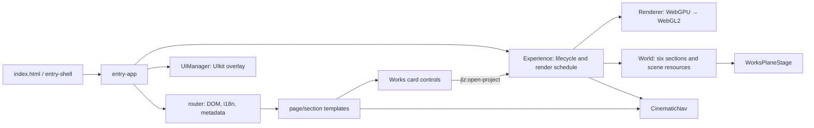

# Technical audit — 2026-07-25

## 1. Executive summary

The repository is a working Vite/TypeScript single-page portfolio with a
separate semantic blog. The product deliberately has a substantial 3D layer:
WebGPU/WebGL2 selection, TSL materials, an event-driven render loop and six
scene sections. That complexity is justified by the product, but the codebase
also carries a few historical layers and duplicated DOM/scene presentation.

The principal risks are not TypeScript correctness (the type check passes),
but the size and responsibility density of `Experience.ts` and `World.ts`,
the parallel untyped DOM event contracts, and CSS delivery that imports more
UIkit than the markup uses. The code is ready for incremental development,
provided new work is kept within existing owners instead of adding another
orchestration layer.

Audit scope was source, runtime composition, asset references, configuration,
unit/E2E suites and a production build. No conclusion below relies only on a
file name.

## 2. Architecture map

State has three forms: direct owner fields (preferred for rendering), the
numeric singleton `StateBus` (section state/opacity interpolation), and
`EventBus` plus local `window` events (cross-owner notifications). Routing is
direct DOM replacement; `CinematicNav` owns scroll track and active section;
`ContentReveal` owns resolved colour mode.

## 3. Critical problems

| ID   | Severity / confidence | Evidence                                                                                                                                                                                    | Scenario and consequence                                                                                                                                                     | Minimal / recommended fix                                                                                                      | Verification                                                                     |
| ---- | --------------------- | ------------------------------------------------------------------------------------------------------------------------------------------------------------------------------------------- | ---------------------------------------------------------------------------------------------------------------------------------------------------------------------------- | ------------------------------------------------------------------------------------------------------------------------------ | -------------------------------------------------------------------------------- |
| A-01 | High / Confirmed      | `src/router.ts:139-145`, `:181-186` before this change                                                                                                                                      | A deep link such as `/works#section-works-03` was rewritten to `/#section-works-03` and scrolled natively. Refresh/bookmark then targets home and DOM/3D state can disagree. | Send the existing `jlz:goto-section-by-hash` request without replacing the path.                                               | Unit/E2E: direct-load and Back/Forward on every `#section-*` target.             |
| A-02 | High / Confirmed      | `src/Experience/Experience.ts:1104-1107`; `src/UI/FullscreenOverlay.ts:403-410`                                                                                                             | Every project open is configured as `video` with the placeholder showreel asset, contradicting the image-mode contract documented by the overlay and architecture.           | Use image mode for project cases; reserve video mode for `UIManager`’s showreel action.                                        | Open card from home and `/works`; no video network request or playback controls. |
| A-03 | Medium / Confirmed    | `src/assets/_import.less:470-513` before this change; markup search has no `uk-card`, `uk-spinner`, `uk-slider`, `uk-table`, `uk-iconnav`, `uk-slidenav`, `uk-column`, `uk-align`, `uk-svg` | Unused UIkit Less components are emitted for both application and standalone blog. Build has a 165.86 kB blog CSS file (21.53 kB gzip).                                      | Remove only proven-unused imports; measure before/after. Do not remove components merely because a class is dynamically added. | Build, visual UIkit modal/nav/tooltip/form verification.                         |
| A-04 | Medium / Confirmed    | `src/Experience/World/WorksTextScreen.ts:121-176` before this change; `index.html:147`                                                                                                      | `/works` adds two Pixelify TTF files (99.7 kB) solely for a texture-rendered title, while the rest of the product uses Onest.                                                | Use the already-loaded Onest face and remove the isolated font files/link.                                                     | Build asset manifest; visit `/works` in EN and RU.                               |

## 4. Overengineering and unnecessary complexity

| ID   | Area               | Current approach                                                                                                                                  | Why it is complex                                                                      | Simpler direction                                                                                                                                          | Benefit                                   | Risk                                           |
| ---- | ------------------ | ------------------------------------------------------------------------------------------------------------------------------------------------- | -------------------------------------------------------------------------------------- | ---------------------------------------------------------------------------------------------------------------------------------------------------------- | ----------------------------------------- | ---------------------------------------------- |
| O-01 | App events         | Typed `EventBus` mirrors selected notifications to `window`, while ten local `jlz:*` events use `window` directly.                                | A consumer must know transport rather than event meaning.                              | Complete the existing documented migration: typed app-lifecycle events use `EventBus`; local DOM controls stay local and are explicitly named as requests. | One subscription convention per scope.    | Medium: touch all listeners together.          |
| O-02 | Section state      | `StateBus` is a global generic string-channel animator for only `Section` and `World`.                                                            | Dynamic channel strings obscure ownership and make `World` depend on singleton timing. | Keep it while section transitions are being tuned; later replace only if all channels remain section-private with fields on `Section`.                     | Potentially removes a global concept.     | Medium; do not change in this pass.            |
| O-03 | Works presentation | Semantic DOM cards and separate Three planes intentionally represent one case.                                                                    | Two layouts, animations and hit paths must remain synchronized.                        | Keep the split (it preserves keyboard semantics), but make DOM cards explicitly control-only and centralize project-open payload/type.                     | Prevents visual/accessibility regression. | Low.                                           |
| O-04 | Styling            | Around 50 `--jlz-*` runtime variables duplicate static Less variables, including aliases with identical values (several radius and fluid tokens). | Two token languages increase search cost.                                              | Keep CSS variables only where runtime theme swap needs them; retain Less variables for UIkit compilation only. Consolidate aliases after consumer audit.   | Smaller, clearer token surface.           | Medium: theme regression if done mechanically. |

## 5. Duplication and unification

| Group     | Evidence                                                                                                                              | Preferred standard                                                                                                                        |
| --------- | ------------------------------------------------------------------------------------------------------------------------------------- | ----------------------------------------------------------------------------------------------------------------------------------------- |
| Events    | `EventBus.ts`, `router.ts`, `Experience.ts`, `WorkCards.ts`                                                                           | Typed `EventBus` for lifecycle; custom DOM events only as document-local command contracts with a declared payload type.                  |
| Cleanup   | Most scene/UI owners correctly expose `dispose()`; `router.ts:108-187` installs one-time global listeners without a matching cleanup. | Long-lived bootstrap owns router listeners; route-local owners must retain handler references and dispose before `innerHTML` replacement. |
| UI styles | UIkit utilities coexist with repeated `.jlz-*` layout/button helpers (`main.less:600-657`, `:743-1003`).                              | UIkit markup, variable/hook, then a scoped `data-*` or `.jlz-*` rule only for 3D shell and bespoke full-screen media.                     |
| Tokens    | `_import.less:24-238` has static and runtime layers; main stylesheet still contains raw white/black alpha values.                     | Tokenise repeated cross-component values; leave genuinely local image scrims local.                                                       |
| Motion    | CSS transitions, `BlurFade`, `NoiseText`, `CinematicNav`, and TSL each have separate owners.                                          | Retain separate owners by rendering domain; all must consume the shared reduced-motion policy and remove their own timers.                |

## 6. Reuse candidates

No new universal visual component is warranted. `sectionShell`, `homeTop`,
`contentTop` and `serviceExplore` in `src/sections/_shared/constants.ts:30-139`
already capture stable shared markup. The Works card must **not** be merged
with ordinary content cards: its DOM is an accessible control surface for a
different Three rendering owner. The only small shared contract worth adding is
the typed `open-project` payload; its API is `{ index: number, source:
'works' | 'home' }`, with source-specific presentation remaining local.

## 7. Potential defects

### Confirmed

See A-01 through A-04.

### High confidence

- `src/Experience/Experience.ts:37-1126` mixes bootstrap, environment-map
  generation, scene lifecycle, page switching, overlay coordination, render
  budget and diagnostics. It is a genuine orchestration object, but its size
  makes unrelated changes collide. Extract only cohesive helpers already
  implied by lifecycle boundaries (environment setup and works-route bridge),
  not a new service layer.
- `src/core/World.ts:27-966` owns scene setup, section configuration,
  transform interpolation, route-specific resource factories and disposal.
  It should retain GPU ownership, but the pure interpolation/easing part can
  become a tested function when behaviour needs to change.

### Runtime verification required

- WebGPU device-loss recovery in `Renderer.ts:205-216` cannot be validated
  without a real WebGPU device; test device loss and fallback on target
  hardware.
- `WorksPlaneStage.ts:145-151` creates all eight full-resolution textures on
  entering `/works`. Measure GPU memory and frame time on a low-memory mobile
  device before adding lazy texture policies.
- The repeated `backdrop-filter` in `main.less:992-997,1070-1076` needs
  Safari/mobile profiling; it is not a proven bottleneck from static code.

## 8. UI/UX and styles

- The project has deliberate keyboard focus styles on cards
  (`main.less:758-761`) and the overlay restores focus (`FullscreenOverlay.ts:197-264`):
  retain these owners.
- The works controls conceal the DOM image because Three owns visible media
  (`main.less:977-990`). This is valid, but the semantic button still needs a
  visible focus/caption state at every breakpoint; test with canvas unavailable.
- `main.less:99-112` and `:949-1003` use `!important` to defeat earlier
  layout rules. This indicates cascade-order coupling. Consolidate section
  display rules before adding selectors; do not escalate specificity.
- The key responsive thresholds are 640/960px in CSS and 960px in
  `WorksPlaneStage.ts:47`; keep that equality explicit. Test between them
  (especially 640–959px) rather than desktop/mobile endpoints only.
- `100dvh` is used consistently in most app shells. The remaining overlay
  `height:100vh` at `main.less:205` should become `100dvh` with a `100vh`
  fallback when that file is next edited.

## 9. Performance

Proven by build: `vendor-three` is 332.42 kB gzip and loaded lazily after the
splash; it meets the repository's documented ≤350 kB target. It should not be
split speculatively. Proven avoidable bytes: unused UIkit CSS and Pixelify
assets (A-03/A-04). Profile, rather than guess, before changing the render
pipeline: capture Chrome Performance frame time, WebGL/WebGPU texture memory,
and Lighthouse mobile LCP after the splash.

## 10. Removal candidates

- Remove the three Pixelify public assets after replacing its sole consumer
  (safe: repository-wide reference search).
- Remove the proven-unused UIkit Less imports in A-03 (safe after build and
  UI smoke test).
- Do not remove `StateBus`, `RenderPipeline`, `WebGPUPostPipeline` or the
  duplicated Works DOM/3D layer: each has live call paths or required
  accessibility/backend responsibilities.

## 11. What not to refactor

- The WebGPU → WebGL renderer fallback is complex but materially necessary;
  `Renderer.ts` correctly bases final capability on the created renderer.
- `FullscreenOverlay` combines video and image modes intentionally; UIkit
  remains the dialog/accessibility owner. Split it only if media modes gain
  independently changing layouts.
- Direct resource disposal across `World`, `Renderer`, planes and textures is
  verbose but correct ownership rather than boilerplate abstraction.

## 12. Target simplified architecture

Keep `entry-app → router/UIManager → Experience → Renderer/World`. Make
`Experience` a thin lifecycle coordinator by moving pure environment creation
and route-to-works coordination to local helpers. Keep `World` as sole scene
owner. Route templates own semantic DOM; the relevant Three group owns pixels.
Use UIkit variables/hooks and supported attributes before scoped app CSS.
Use `data-page`, `data-page-section`, `data-cinematic-*` as application state
hooks; reserve `.jlz-*` for a real bespoke visual component.

## 13. Refactoring plan

### A — safe improvements (low risk)

1. Fix deep-link hash dispatch (A-01), remove dead UIkit CSS imports (A-03),
   replace Pixelify (A-04), and make project overlay image-only (A-02).
2. Rebuild, type-check, lint, unit test, and exercise `/works` in both themes.

### B — structural simplification (medium risk)

1. Document/type all remaining DOM event payloads; migrate lifecycle events.
2. Extract pure `World` interpolation only with snapshot tests for section
   results. Do not add a DI container or generic state machine.

### C — UI/performance (medium risk)

1. Replace `!important` display overrides with a single section-shell cascade.
2. Audit runtime CSS variables and raw repeated alpha colours.
3. Profile mobile works texture allocation and backdrop filters; optimise only
   if a recorded budget fails.

### D — high-risk changes (only if measurements require them)

1. Reconsider `StateBus` only after its remaining channel count and section
   animation requirements are stable.
2. Split `Experience` only along measured churn boundaries.

## 14. Priority backlog

| Priority | Task                                              | User effect                                           | Complexity / risk |
| -------- | ------------------------------------------------- | ----------------------------------------------------- | ----------------- |
| P1       | Correct project image-mode and hash navigation    | Correct deep links and no placeholder video for cases | Low / low         |
| P1       | Remove unused UIkit imports and Pixelify assets   | Smaller delivery, consistent Works typography         | Low / low         |
| P2       | Unify event contract ownership                    | Safer route/section integration                       | Medium / medium   |
| P2       | Collapse section display cascade                  | Fewer responsive/style regressions                    | Medium / medium   |
| P3       | Reduce runtime token aliases after consumer audit | Easier style maintenance                              | Medium / low      |

## Verification snapshot

On 2026-07-25 after the audit-led change: `format:check`, `type-check`, build
and 105 unit tests passed. ESLint has 60 warnings and no errors. Playwright
ran with a bindable preview server: 11/12 passed in the first full run and the
single mobile UIkit-nav scenario passed three consecutive isolated runs, so it
is recorded as test timing flakiness rather than a confirmed product defect.
