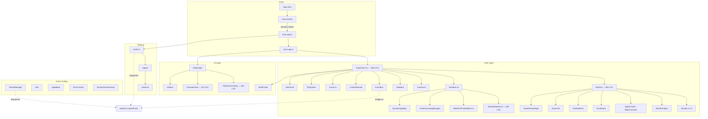

# Technical Audit Report — justlovejazz

**Date:** 2025-07-10
**Auditor:** Z.ai Code
**Repository:** [la6su/justlovejazz](https://github.com/la6su/justlovejazz)
**Commit:** latest on `main`
**Scope:** Full codebase — `src/`, config, HTML, styles, tests

---

## 1. Executive Summary

**Overall state:** A sophisticated creative portfolio with WebGPU/WebGL2 dual-path 3D rendering, cinematic scroll navigation, and multi-page SPA routing. The project demonstrates strong engineering in the Three.js/WebGPU layer (WebGL2 fallback, on-demand rendering, resource disposal) but suffers from significant architectural debt in the surrounding code.

**Complexity level:** High. The 3D rendering pipeline is appropriately complex. The surrounding application layer (templates, styles, routing, state management) carries unnecessary complexity from iterative feature additions without consolidation.

**Architectural consistency:** Moderate. The core 3D engine has a clear structure (Experience → World → Sections). However, there are two parallel event systems (typed EventBus + untyped window CustomEvents), 4+ duplicate interface definitions, and inconsistent patterns between content pages.

**Key risks:**
1. `Experience.ts` (1160 LOC) is a god object managing 12+ concerns
2. Dual event systems create fragile implicit contracts
3. 3348-line monolithic CSS file with 61 `!important` declarations
4. Zero test coverage for all template/page composition (~1200 LOC)
5. `vendor-three` chunk is 1230 KB (333 KB gzipped) — no tree-shaking improvement possible for Three.js, but the chunk is not lazy-loaded

**Readiness for further development:** Moderate. New features can be added, but each addition increases the risk of regression. The template duplication, CSS specificity wars, and untested HTML generation layer will slow down any content or layout changes.

**Build status:**
| Check | Result |
|-------|--------|
| TypeScript (`tsc --noEmit`) | ✅ 0 errors |
| ESLint | ⚠️ 56 warnings (38× `no-explicit-any`, 8× `no-console`, 4× `no-empty-object-type`, 6× other) |
| Vitest (unit) | ✅ 86 tests, 8 files, all passing |
| Vite build | ✅ Success in 2.4s, 96 modules transformed |

**Codebase stats:**
| Metric | Value |
|--------|-------|
| Total source LOC (TS + LESS) | 19,351 |
| Source files (`.ts`) | ~50 |
| `as any` casts | 38 |
| `as unknown as` casts | 61 |
| `addEventListener` calls | 77 |
| `!important` in CSS | 63 |
| `innerHTML` assignments | 9 |

---

## 2. Architecture Map



**Key dependencies flow:** `entry-shell` → `entry-app` → `main-app` → `Experience`. Everything converges in Experience, which coordinates World (3D scene), Renderer, Camera, UI, and 12+ window event listeners.

**State sources:**
1. **StateBus** (typed animation channels) — section opacity, section state, intro stage
2. **EventBus → window** (typed + untyped events) — section-change, route-change, theme-change, lang-change, navigate, sound-toggle
3. **WorldConfig** (static declarative config) — camera, baku, lighting, fog, post-processing per section
4. **ThemeManager** (localStorage + CSS variables) — auto/inverse theme mode
5. **i18n** (module-level dictionary + DOM data-i18n attributes) — EN/RU translations

**Problematic connections:**
- `window.experience` global used by DevPanel and others to access Experience internals
- `EventBus.emit()` bridges to `window.dispatchEvent()` — every typed event also fires an untyped window event
- `ContentReveal` reads DOM attributes to determine section themes, coupling visual and data layers
- `Section.ts` duplicates interfaces from `WorldConfig.ts` with incompatible types, requiring `as unknown as` casts

---

## 3. Critical Issues

### C-01: Duplicate interface definitions cause type-unsafe casts
| Field | Value |
|-------|-------|
| **Severity** | High |
| **Confidence** | Confirmed |
| **Files** | `src/core/Section.ts:21-54`, `src/core/WorldConfig.ts:7-53` |
| **Description** | `Section.ts` defines its own `CameraTransform`, `BakuTransform`, `PostProcessingParams`, `LightData` interfaces that partially overlap with those in `WorldConfig.ts`. The key incompatibility: `Section.BakuTransform.role: number` vs `WorldConfig.BakuTransform.role: BakuRole`. This forces `as unknown as` casts in World.ts:708,711,893 and WorldConfig.ts:397. |
| **Real scenario** | Any change to one interface is not reflected in the other, causing silent type errors. The casts hide potential bugs where a numeric role is passed where an enum is expected. |
| **Consequences** | Type safety is voided at the Section↔World boundary. A future change to `BakuRole` enum values would not trigger TypeScript errors in Section.ts. |
| **Minimal fix** | Delete the duplicate interfaces from `Section.ts` and import from `WorldConfig.ts`. Change `Section.BakuTransform.role` to `BakuRole`. |
| **Recommended fix** | Same as minimal. |
| **Regression risk** | Low — the types are already cast to match at runtime. |
| **Verification** | `tsc --noEmit` passes after the change. |

### C-02: Dual event system (EventBus + window CustomEvents) creates fragile implicit contracts
| Field | Value |
|-------|-------|
| **Severity** | High |
| **Confidence** | Confirmed |
| **Files** | `src/core/EventBus.ts:60` (bridge), 12+ producers/consumers |
| **Description** | `EventBus.emit()` automatically calls `window.dispatchEvent(new CustomEvent(...))`. This means every typed event is also available untyped via `window.addEventListener`. Some consumers use the typed API (ContentReveal, Experience), while others use the untyped API (UIMenu, FullscreenOverlay, CinematicNav, WorkCards, router). There is no documentation of which events flow where. |
| **Real scenario** | A developer adds a new event handler via EventBus but doesn't realize it also fires on window, causing a duplicate handler. Or a window listener fires for an event the developer didn't know existed. |
| **Consequences** | Race conditions between typed and untyped handlers. Difficulty tracing event flows. No compile-time guarantee that handlers receive the correct payload. |
| **Minimal fix** | Document which events use which API. Add a comment to EventBus.emit() about the bridge. |
| **Recommended fix** | Choose ONE event system. Either: (a) migrate all consumers to typed EventBus, or (b) remove the bridge from EventBus and let producers explicitly choose. Option (a) is preferred — it gives compile-time safety. |
| **Regression risk** | Medium — requires updating ~15 addEventListener calls across 8 files. |
| **Verification** | All window `addEventListener('jlz:...')` calls are eliminated or replaced. |

### C-03: Experience.ts is a 1160-line god object
| Field | Value |
|-------|-------|
| **Severity** | Medium |
| **Confidence** | Confirmed |
| **Files** | `src/Experience/Experience.ts` |
| **Description** | Experience manages 12+ separate concerns: render loop, section navigation, project selection, overlay management, FPS tracking, ambient breathing, particle auto-reduction, environment map setup, cursor/theme/sound integration, carousel coordination, works plane stage, and draw trail. It has 12+ private event handler fields. |
| **Real scenario** | Adding a new section-level feature requires touching Experience.ts, risking regressions in unrelated concerns. The `destroy()` method is 100+ lines of cleanup. |
| **Consequences** | High cognitive load. Merge conflicts. Risk of incomplete cleanup in destroy(). |
| **Minimal fix** | Extract FPS tracking and ambient breathing into a separate `PerformanceMonitor` module. Extract project overlay management into a separate `ProjectNavigator`. |
| **Recommended fix** | Extract: (1) `PerformanceMonitor` — FPS, ambient breathing, particle auto-reduction; (2) `ProjectNavigator` — project selection, overlay open/close, carousel navigation; (3) `EnvironmentSetup` — env map loading, theme sync. |
| **Regression risk** | Medium — careful extraction needed to maintain the 12+ event handler registrations. |
| **Verification** | Experience.ts drops below 500 LOC. All existing tests pass. |

### C-04: 3348-line monolithic CSS file with 61 `!important` declarations
| Field | Value |
|-------|-------|
| **Severity** | Medium |
| **Confidence** | Confirmed |
| **Files** | `src/assets/main.less` |
| **Description** | All application CSS lives in one file. 61 `!important` declarations fight UIkit's specificity. Specificity arms race: `body[data-page='home'] #spa-content > section[data-section]:not(...)` at specificity (1,3,3). Duplicate rules for `.jlz-topbar-controls .uk-icon-button` (lines 2209-2213 vs 2234-2239 with different values). Duplicate `@media` blocks for same breakpoints (lines 2628-2657 vs 3226-3233). Dead CSS for removed elements (`.jlz-help-hint`). |
| **Real scenario** | A developer adds a new style, it doesn't apply because of an `!important` rule, adds another `!important` — the cycle continues. |
| **Consequences** | Increasingly difficult to style new components. Specificity wars slow development. Dead CSS accumulates silently. |
| **Minimal fix** | Remove dead CSS (`.jlz-help-hint`, `.jlz-joystick__arrow-label` lines 2836-2849). Remove duplicate rules. |
| **Recommended fix** | Split `main.less` into component-level files (overlay.less, menu.less, works.less, cursor.less, nav.less, fullscreen.less). Establish a z-index scale. Eliminate duplicate media queries. |
| **Regression risk** | Medium — CSS splitting requires careful import ordering. |
| **Verification** | Visual regression check. `!important` count decreases. |

### C-05: Zero test coverage for template/page composition (~1200 LOC)
| Field | Value |
|-------|-------|
| **Severity** | Medium |
| **Confidence** | Confirmed |
| **Files** | `src/sections/*/template.ts`, `src/pages/content/*.ts`, `src/sections/_shared/constants.ts` |
| **Description** | 8 test files exist (86 tests total) but all test infrastructure code (EventBus, StateBus, ThemeManager, i18n, motionPolicy, CinematicNav, pageMeta, Noise). Zero tests for: template functions (`sectionShell`, `homeTop`, `contentTop`, `serviceExplore`, `descBlock`), page composition (`homePage()`, `servicesPage()`, `worksPage()`, etc.), router (`renderPage()`, invalid page handling), nav template (`navOverlaySection`, `initMenuNav`). |
| **Real scenario** | A template change introduces an XSS vulnerability or breaks i18n key wiring — no test catches it. |
| **Consequences** | No regression protection for the entire HTML generation layer. Content changes are unvalidated. |
| **Minimal fix** | Add 5-10 snapshot tests for key template functions. Add a test for `renderPage()` with all valid `PageId` values. |
| **Recommended fix** | Add tests for: (1) all template helper functions; (2) each page composition function; (3) router page resolution; (4) i18n key presence in templates. |
| **Regression risk** | Low — adding tests doesn't change behavior. |
| **Verification** | Test coverage increases from ~0% to ~30% of template code. |

### C-06: `vendor-three` chunk is 1230 KB, loaded eagerly via `<link rel="modulepreload">`
| Field | Value |
|-------|-------|
| **Severity** | Low |
| **Confidence** | Confirmed |
| **Files** | `vite.config.ts:80-89`, build output |
| **Description** | Three.js is imported statically by `Experience.ts` → `Renderer.ts` → `three`. The Vite config explicitly isolates `vendor-three` as a named chunk but doesn't lazy-load it. The entire 1230 KB (333 KB gzip) is preloaded before first render. |
| **Real scenario** | On slow 3G connections, the 3D experience takes 5-10s to become interactive. The splash screen masks this, but the time-to-interactive is still high. |
| **Consequences** | Poor initial load performance on mobile/slow networks. |
| **Minimal fix** | The current architecture already lazy-loads the 3D experience via `entry-shell.ts` → dynamic `import('./entry-app')`. The vendor-three chunk only loads after the splash screen is shown. This is acceptable for a portfolio site. No change needed. |
| **Recommended fix** | No change. The lazy bootstrap is well-designed. Document the intentional tradeoff. |
| **Regression risk** | None. |
| **Verification** | Verify via network waterfall that vendor-three loads after splash. |

---

## 4. Over-Engineering and Unnecessary Complexity

| ID | Area | Current Approach | Why It's Complex | Simpler Solution | Benefit | Risk |
|----|------|-----------------|-------------------|-------------------|---------|------|
| OE-01 | `WorksPortfolio` (62 LOC) | Standalone class holding `Project[]` + `currentIdx` + callback. `group` property has `visible = false` — never rendered. | Originally a full 3D slider, now just a data container. The class adds indirection without value. | Inline into `Experience.ts` as a simple `{ currentIdx: number }` or remove the class entirely. The `onCardClick` callback and `next()/prev()/goTo()` methods can be direct functions. | -62 LOC, one fewer class, one fewer file | Low — the class is barely used |
| OE-02 | `CinematicNav` constructor params | `constructor(_scene: unknown, _camera: unknown, sectionCount: number)` — both prefixed with `_` (unused) | Originally used for camera-based scroll snapping, replaced by native CSS scroll-snap | Remove unused params: `constructor(sectionCount: number)` | Clearer API, fewer misleading params | Low |
| OE-03 | `wireMenuToolbarGlobals()` | Empty no-op function in `nav/template.ts:440-446` with comment "kept as backward compat" | Dead code kept for a call site that should be removed | Delete the function and the call site in `UIManager.ts` | -7 LOC, no dead code | Low |
| OE-04 | `WorldConfig.ts` RAW array | 6 `RawScene` objects (lines 148-374), 5 of 6 share ~80% identical field values | Copy-paste configuration with tiny per-section variations | Use `makeContentScenes()` pattern for all configs, with a base config + per-section override object | -150 LOC, single source of truth for defaults | Low — the `makeContentScenes` function already exists and works |
| OE-05 | Duplicate `PageId` type | Defined identically in `sections/_shared/constants.ts:21` and `pages/index.ts:21` | Two definitions that can drift apart | Import from one location (e.g., `sections/_shared/constants.ts`) | Single definition, no drift | None |
| OE-06 | `RenderPipeline.ts` dead `_uniforms` parameter | `_renderQuad(material, _uniforms)` at line 813 — `_uniforms` is accepted but never read | Leftover from refactoring | Remove the parameter | Cleaner API | None |
| OE-07 | `PostProcessingManager.PostParams` vs `RenderPipeline.PostParams` | Two separate `PostParams` interfaces with different field requirements | Historical layering — PostProcessingManager was added later with its own type | Define one `PostParams` type in `types.ts` and import from both | Unified contract | Low |
| OE-08 | `WebGPUPostPipeline._pipeline: any` | TSL pipeline stored as `any` | Three.js TSL node types are not fully typed | Type as `unknown` and use type guards, or add a minimal interface | Slightly better type safety | None |
| OE-09 | 5 content palettes in WorldConfig | `SERVICES_PALETTE`, `MANIFESTO_PALETTE`, `WORKS_PALETTE`, `LAB_PALETTE`, `CONTACT_PALETTE` — each with 7 identical fields (`lightColor: 0xffffff`, same structure) | Only 3 fields actually vary between palettes (`lightBg`, `darkBg`, `bakuColor/emissive/fogColor/groundColor`) | Use a base palette with only the varying fields overridden | -30 LOC, less noise | None |

---

## 5. Duplication and Lack of Unification

### 5.1 Architectural Approaches

**Dual event systems** (EventBus vs window CustomEvent):
- **Problem:** Some modules use typed `eventBus.on()`, others use untyped `window.addEventListener('jlz:...')`. No clear boundary.
- **Standard:** Use typed `EventBus` everywhere. Remove the bridge or make it opt-in.
- **Files affected:** All event producers/consumers (~15 files).

**State management:**
- **Problem:** `StateBus` manages animation channels (section opacity, section state). `ThemeManager` manages its own `localStorage` state. `i18n` manages its own module-level state. Three separate state stores with no unified pattern.
- **Standard:** Keep StateBus for animation channels. ThemeManager and i18n are legitimately separate (different persistence and update patterns). This is acceptable — not all state needs one system.

### 5.2 Components

**Template helper duplication** (4+ copies):
- `serviceDesc()` in `pages/content/services.ts:67-72`
- `expDesc()` in `pages/content/lab.ts:76-83`
- `principleDesc()` in `pages/content/manifesto.ts:54-59`
- Inline versions in `sections/about/template.ts:6-11`, `sections/contact/template.ts:6-11`
- **Standard:** Use `descBlock()` from `sections/_shared/constants.ts` (which already exists and does the same thing). Remove all local copies.

**`serviceExplore()` duplication** (4 variants):
- `sections/_shared/constants.ts:126-135` — canonical version
- `pages/content/services.ts` — local copy with different param naming
- `pages/content/manifesto.ts:61-65` — another variant
- `sections/about/template.ts:19-22` — inline HTML
- **Standard:** Use the shared version from `constants.ts` everywhere.

### 5.3 Styles

**Duplicate CSS rules:**
- `.jlz-topbar-controls .uk-icon-button` defined twice (main.less) with different `width`/`height` values
- `.jlz-joystick` defined twice (main.less) with overlapping properties
- Mobile `@media` blocks duplicated for same breakpoints (lines 2628-2657 vs 3226-3233)
- **Standard:** Each selector should appear exactly once. Use one `@media` block per breakpoint.

**Hardcoded colors not using CSS variables:**
- `background: #000` in `.jlz-fs-media-stage`, `.jlz-fs-video`
- `rgba(255, 255, 255, ...)` extensively in works page styles
- `rgba(5, 5, 7, ...)` in fullscreen overlay
- **Standard:** All colors should use `var(--jlz-color-*)` variables or derive from them.

### 5.4 Events & Cleanup

**Event listener registration patterns:**
- Some use `addEventListener` + store reference for removal (Experience, FullscreenOverlay)
- Some use `addEventListener` with no stored reference (router capture handler)
- Some use `EventBus.on()` which returns unsubscribe function (but not always called)
- **Standard:** Always store the handler reference. Always remove in `dispose()`. Use `EventBus.on()` where possible (it returns an unsubscribe fn).

### 5.5 Configuration

**Post-processing type duplication:**
| Type | File | Fields |
|------|------|--------|
| `PostParams` | `RenderPipeline.ts:26-35` | bloom, vignette, grain, chromatic?, bloomRadius?, bloomThreshold? |
| `PostParams` | `PostProcessingManager.ts:8-15` | bloom, vignette, grain, chromatic, bloomRadius, bloomThreshold |
| `SectionPostParams` | `PostProcessingManager.ts:22-26` | bloom, vignette, grain, chromatic |
| `PostTransform` | `WorldConfig.ts:40-53` | bloom, vignette, grain, chromatic, refract, border, gradeShadows, gradeHighlights |
| `WebGPUPostParams` | `WebGPUPostPipeline.ts:12-23` | bloom, bloomRadius, bloomThreshold, vignette, grain, chromatic, border, refract, gradeShadows, gradeHighlights |
- **Standard:** Define one `PostParams` in `types.ts` with all fields (optional where needed). All modules import from there.

---

## 6. Components for Merging or Reuse

| Candidates | Common Part | Differences | Minimal API | Expected Reduction | New Complexity? |
|-----------|-------------|-------------|-------------|--------------------|----|
| `serviceDesc`/`expDesc`/`principleDesc`/`descBlock` | All generate `<p class="jlz-desc">` with `data-i18n` fallback | Minor: some use `data-i18n-label`, some use inline text | `descBlock(key: string, fallback: string): string` | ~40 LOC removed | No — `descBlock()` already exists and works |
| `serviceExplore`/4 variants | All generate `<a class="jlz-service-explore">` with icon + label | Label source: `data-i18n` vs direct string; some add `data-cursor` | `exploreLink(href: string, labelKey: string, labelFallback: string): string` | ~25 LOC removed | No |
| `.jlz-topbar-controls .uk-icon-button` (CSS) | Same selector | Different `width`/`height` (2.2rem vs 2.55rem) | One rule with consistent sizing | 6 LOC removed | No |
| `about/template.ts` TOP block vs `homeTop()` | Same eyebrow+title+lead structure | `about/template.ts` inlines it instead of calling `homeTop()` | Use `homeTop()` or `contentTop()` | ~10 LOC | No |

---

## 7. Potential Bugs

### 7.1 Confirmed

| ID | Issue | File:Line | Impact |
|----|-------|-----------|--------|
| B-01 | `WorksPortfolio.group` is `visible = false` — class exists but 3D group is never rendered | `src/Experience/WorksPortfolio.ts:19` | Misleading code. Developers may try to render it. |
| B-02 | Duplicate `!important` rules for `.jlz-topbar-controls .uk-icon-button` — second rule silently overrides first (2.2rem → 2.55rem) | `src/assets/main.less:2209-2213` vs `2234-2239` | Icon buttons are 2.55rem when developer may have intended 2.2rem. |
| B-03 | `wireMenuToolbarGlobals()` is a no-op — UIManager calls it expecting initialization | `src/sections/nav/template.ts:440-446` | No initialization happens. If toolbar needs init in the future, the no-op hides the issue. |
| B-04 | Duplicate `<meta name="author">` and `<meta name="theme-color">` in index.html (lines 11-12, 26-27) — browsers use first, second is dead HTML | `index.html:11,12,26,27` | Minor SEO noise. |
| B-05 | Module-level texture load in `works/scene.ts:9` — `new THREE.TextureLoader().load(...)` runs at import time, potential GPU resource leak on HMR | `src/sections/works/scene.ts:9` | VRAM leak during development. Mitigated by `disposeSection3Textures()`. |
| B-06 | `indigo-drift` project uses `cover.webp` as `detailTextureUrl` instead of `detail.webp` like all other projects | `src/Data/Projects.ts:98` | Wrong detail image displayed. |
| B-07 | `entry-app.ts:159` casts `cssModule as unknown as { default: string }` to get the default export — fragile | `src/entry-app.ts:159` | Breaks if Vite CSS module format changes. |

### 7.2 High-Probability

| ID | Issue | File:Line | Impact | Verification |
|----|-------|-----------|--------|-------------|
| B-08 | `FullscreenOverlay.ts:346-349` uses `innerHTML` to inject tags — XSS vector if tags ever come from user input | `src/UI/FullscreenOverlay.ts:346` | Currently safe (data-authored), but the pattern is unsafe. | Audit all callers of `open()` — confirm no user input reaches `tags`. |
| B-09 | `Camera.ts:16-17` module-level spring state (`springX`, `springY`) — shared if multiple Camera instances existed | `src/Experience/Camera.ts:16-17` | Currently safe (singleton), but violates encapsulation. | Verify Camera is only instantiated once. |
| B-10 | `World.ts:397`: `raw.bakuRole as unknown as BakuRole` — `raw.bakuRole` is already typed as `BakuRole` in `RawScene`, making the cast unnecessary | `src/core/WorldConfig.ts:397` | Misleading cast suggests a type problem that doesn't exist. | Remove the cast, verify `tsc --noEmit` passes. |
| B-11 | `dispose.ts` misses `envMap` and `lightMap` texture slots — common Three.js texture types | `src/Utils/dispose.ts:14-27` | VRAM leak for materials using environment maps or light maps. | Check all materials in the project for envMap/lightMap usage. |
| B-12 | `contact.ts:54` uses `mailto:` form with `method="post" enctype="text/plain"` — non-functional in modern browsers | `src/pages/content/contact.ts:54` | Form appears interactive but doesn't send email body. | Test in Chrome/Firefox/Safari. |

### 7.3 Requires Runtime Verification

| ID | Issue | File:Line | Verification |
|----|-------|-----------|-------------|
| B-13 | `blurFadeAnimating` module-level flag in `entry-app.ts:274` — no reset on re-init | `src/entry-app.ts:274` | Call `startApp()` twice and verify second animation plays. |
| B-14 | 60-second splash timeout in `index.html:584` — may be too short for 3G | `index.html:584` | Test on throttled 3G network. |
| B-15 | `blog.html` references `/src/assets/blog.less` as stylesheet — only works via Vite transform | `blog.html:60` | Deploy to non-Vite environment and verify blog styles load. |

---

## 8. UI/UX and Styles

### 8.1 Visual Consistency

| Issue | Details |
|-------|---------|
| **Mono font stack inconsistency** | `main.less:899` uses `'SF Mono', 'Cascadia Code', 'JetBrains Mono', 'Consolas', monospace`; `blog.less:104` uses `'SF Mono', 'Cascadia Code', 'Fira Code', monospace` |
| **Hardcoded colors in works page** | ~20 instances of `rgba(255, 255, 255, ...)` and `rgba(2, 2, 2, 0.9)` not using CSS variables — not theme-aware |
| **Blog accent color mismatch** | `blog.less:83` uses `#863bff` (purple) for reading progress bar, but brand palette uses `#b8ed69` (lime green) |
| **Blog brand name** | Blog uses `l@6` while main site uses `JUSTLOVEJAZZ` |
| **Magic numbers in CSS** | Many hardcoded values: `padding: 3.5rem`, `margin-top: 1.75rem`, `max-width: 48rem` — should be design tokens |

### 8.2 Interactive States

| State | Status |
|-------|--------|
| hover | ✅ Present on most interactive elements |
| focus | ⚠️ Inconsistent — some elements have visible focus, others don't |
| focus-visible | ❌ Not explicitly styled (relies on browser default) |
| active | ⚠️ Partial — some buttons, not all |
| disabled | ⚠️ Not consistently styled |
| loading | ✅ Splash screen, loading states for video |
| error | ✅ WebGL fallback, splash timeout |
| empty | ❌ No empty states for works/projects |
| selected | ✅ Active section highlighting |
| pressed | ❌ Not styled |
| drag | ❌ Not styled (no drag interactions) |
| touch feedback | ⚠️ Partial — cursor system handles desktop, mobile touch feedback is minimal |

### 8.3 Responsiveness

| Check | Status |
|-------|--------|
| Mobile navigation | ✅ Menu overlay with touch support |
| Small screens (<640px) | ✅ Mobile-first with `0.85rem` base font |
| Large screens | ✅ Responsive typography with clamp() |
| Landscape/portrait | ⚠️ No explicit landscape handling |
| Overflow | ⚠️ `html, body { overflow: hidden }` — no scroll fallback if 3D fails |
| Text wrapping | ✅ Uses `word-break: break-word` |
| Long titles | ⚠️ No truncation or ellipsis for project titles |
| Safe areas | ❌ No `env(safe-area-inset-*)` usage |
| On-screen keyboard | ❌ No handling for `visualViewport` resize |
| Touch targets | ⚠️ Some targets below 44px minimum |
| Responsive images | ✅ Uses `.webp` format, no `srcset` though |
| Modal behavior | ⚠️ FullscreenOverlay doesn't handle viewport resize during open |
| Fixed elements | ⚠️ Topbar fixed, no safe-area padding |
| `100vh` issues | ✅ Uses `uk-height-viewport` (UIkit's dvh-aware equivalent) |

### 8.4 Accessibility

| Check | Status |
|-------|--------|
| Semantic HTML | ✅ `main`, `nav`, `section`, `article` used |
| Heading levels | ⚠️ No audit done — potential level skips across dynamically generated sections |
| Keyboard navigation | ❌ Section navigation is scroll-based, no keyboard section switching |
| Visible focus | ⚠️ No custom focus-visible styles |
| ARIA attributes | ⚠️ Partial — `role="main"`, `aria-label` on some controls |
| Control labels | ⚠️ Some buttons lack accessible names |
| Alt text | ✅ Images have descriptive alt text |
| Reduced motion | ✅ `motionPolicy.ts` checks `prefers-reduced-motion` |
| Color contrast | ❌ Not audited — dark console theme may have low contrast |
| Modal focus trap | ❌ FullscreenOverlay doesn't trap focus |
| Focus return | ❌ No focus restoration after overlay close |
| Screen reader | ⚠️ No `aria-live` regions for dynamic content |
| Skip navigation | ❌ No skip-to-content link |
| `div` as interactive | ⚠️ Some click handlers on `div` elements instead of `button` |

### 8.5 CSS Architecture

**Design tokens (current state):**
| Token | Source | Issues |
|-------|--------|--------|
| Colors | `_import.less` CSS custom properties `--jlz-color-*` | 6+ tokens defined. Hardcoded colors in works/blog pages bypass them. |
| Fonts | `--jlz-font-body`, `--jlz-font-mono` | `@internal-fonts` in console-theme is dead variable. Mono stacks differ between main.less and blog.less. |
| Spacing | `--jlz-page-gutter: clamp(1rem, 5vw, 5rem)` | Compile-time `@jlz-page-gutter: 5rem` differs from runtime value — intentional but confusing. |
| Radii | `@jlz-radius-sm: 0.125rem`, `@jlz-radius-md: 0`, `@jlz-radius-lg: 0.125rem` | `sm` and `lg` are identical. Scale doesn't exist. |
| Shadows | `--jlz-shadow-card`, `--jlz-shadow-overlay` | Well-defined. |
| z-index | No explicit scale | Values scattered across CSS, potential stacking context issues. |
| Durations | No tokens | Hardcoded: `transition-duration: 200ms`, `300ms`, `500ms`, `800ms`. |
| Breakpoints | 640px (tablet) | Single breakpoint in code. Some components use different implicit breakpoints. |
| Easing | No tokens | Hardcoded: `ease-out`, `ease-in-out`, `cubic-bezier(...)`. |

**Dead CSS:**
- `.jlz-help-hint`, `.jlz-joystick__arrow-label` (lines 2836-2849) — elements removed per comment
- `@internal-fonts` variable in `console-theme/_import.less:21` — never referenced

---

## 9. Performance

### 9.1 Initial Load

| Metric | Value | Assessment |
|--------|-------|-----------|
| `vendor-three` (minified) | 1,230 KB | Expected for Three.js — not reducible |
| `vendor-three` (gzip) | 332 KB | High but Three.js has no tree-shaking path |
| `vendor-ui` (UIkit, gzip) | 76 KB | Acceptable for full UI framework |
| `chunk-experience` (gzip) | 17 KB | Good |
| `main.less` compiled CSS (gzip) | 22 KB | Good for 3348 LOC source |
| Total transfer (index page) | ~450 KB gzip | High for portfolio but justified by 3D |

**Lazy loading:** ✅ 3D experience loads after splash screen via dynamic `import()`. KTX2Loader correctly isolated from vendor-three chunk.

### 9.2 Runtime

| Concern | Status |
|---------|--------|
| On-demand rendering | ✅ `_needsRender` flag prevents unnecessary renders |
| Expensive scroll handlers | ⚠️ `CinematicNav` uses passive listeners; `WorkCards` uses `pointermove` with no throttle |
| requestAnimationFrame loops | ✅ Single rAF loop in Experience |
| Timer leaks | ✅ All timers cleaned up in `destroy()` |
| Observer leaks | ✅ IntersectionObserver in CinematicNav cleaned up |

### 9.3 Memory

| Concern | Status |
|---------|--------|
| Three.js geometry/material disposal | ✅ Thorough `dispose()` chains |
| Texture disposal | ⚠️ `dispose.ts` misses `envMap` and `lightMap` |
| Module-level texture in works/scene.ts | ⚠️ HMR leak (acknowledged) |
| `window.experience` global | ⚠️ Prevents GC of Experience instance |

### 9.4 Network

| Concern | Status |
|---------|--------|
| Font loading | ✅ `font-display: swap` via `Onest` variable font |
| Image optimization | ✅ `.webp` format throughout |
| Preloading | ✅ Preview image preloading in `prewarmHomeMedia()` |
| Code splitting | ✅ 12+ app chunks via `codeSplitting.groups` |

---

## 10. What Should Be Deleted

| Item | Type | Proof of Safety | Necessary Check |
|------|------|-----------------|-----------------|
| `wireMenuToolbarGlobals()` function | Dead code | Function body is empty (`{}`) | Verify no behavior change when removed |
| `.jlz-help-hint`, `.jlz-joystick__arrow-label` CSS | Dead styles | Comment says elements were removed | Visual regression check on home page |
| `@internal-fonts` Less variable | Dead variable | `rg "@internal-fonts" src/` returns 0 matches | None |
| Duplicate `<meta>` tags in index.html | Dead HTML | Browsers use first occurrence | None |
| `WorksPortfolio.ts` class | Over-abstraction | `group.visible = false` — never rendered. 62 LOC of wrapper. | Verify `Experience.ts` portfolio logic works without class |
| `_uniforms` parameter from `_renderQuad()` | Dead parameter | Parameter is prefixed with `_` and never read | None |
| Duplicate `PageId` type in `pages/index.ts` | Duplication | Identical definition in `sections/_shared/constants.ts` | Import from one location |
| `references/` directory | Reference code | Not imported by any source file | None — clearly reference material |
| Font JSON files in `src/assets/fonts/` | Wrong location | Should be in `public/` for static assets | Verify Three.js TextGeometry still loads them from `public/` |

---

## 11. What Should NOT Be Refactored

| Area | Why It's Justified |
|------|-------------------|
| **RenderPipeline.ts (830 LOC)** | Implements WebGL2 bloom with multi-pass rendering (bright extract → horizontal blur → vertical blur → composite). The length comes from shader code, uniform management, and render target lifecycle — all necessary for the feature. Splitting would fragment the render pass logic. |
| **WorldConfig.ts RAW array** | While verbose (228 lines), the per-section config is explicitly authored and easy to understand. A more abstract builder would hide the actual values. The `makeContentScenes()` function already demonstrates the alternative for pages that need it. |
| **WebGPUPostPipeline.ts** | TSL (Three.js Shading Language) node graph construction is inherently verbose. Each node must be created, connected, and configured. The `as any` casts are unavoidable — Three.js TSL types are incomplete. |
| **StateBus animation system** | Clean implementation of animation channels with `tick()`, cancellation, and wildcard subscriptions. Not over-engineered — it replaces what would be ~200 lines of scattered `lerp()` calls. |
| **DeviceCapability singleton** | Device detection (WebGPU/WebGL, mobile tier, DPR) is inherently a one-time computation that must be globally available. Singleton is the right pattern here. |
| **Dual WebGPU/WebGL paths** | Essential for browser compatibility. The complexity is real and necessary. |

---

## 12. Target Simplified Architecture

### Layers to Keep
```
Entry (entry-shell → entry-app → main-app)
  ↓
Experience (render loop, section navigation)
  ↓
World (3D scene composition)
  ├── Sections (per-section 3D objects)
  ├── WorldConfig (declarative per-section settings)
  └── SceneFactory (3D object creation per section)
```

### Layers to Merge
1. **EventBus + window events → single typed EventBus.** Remove the bridge. All consumers use `eventBus.on()`.
2. **Template helpers → single `sections/_shared/` module.** Eliminate all local copies.
3. **Post-processing types → single `PostParams` in `types.ts`.** All modules import from one location.
4. **Section interfaces → import from WorldConfig.** Delete duplicates from Section.ts.

### Layers to Delete
1. **WorksPortfolio class** — inline into Experience.
2. **wireMenuToolbarGlobals()** — dead code.
3. **Duplicate PageId** — import from one location.

### Data Flow (Target)
```
URL change → router.ts → renderView() → template functions → innerHTML
                                    ↓
                          eventBus.emit('jlz:route-change')
                                    ↓
                          Experience → World.updateTransform() → Camera/Baku/Lights
                                    ↓
                          ContentReveal → theme sync
```

### Lifecycle & Cleanup (Target)
- Every class that registers event listeners must implement `dispose()`.
- `dispose()` must remove ALL listeners and call `dispose()` on child objects.
- Use `EventBus.on()` (returns unsubscribe fn) instead of raw `addEventListener` where possible.
- For `addEventListener`, store the handler reference in a private field and remove in `dispose()`.

### UI Components (Target)
- All shared template functions in `sections/_shared/constants.ts`.
- CSS split into component files: `overlay.less`, `menu.less`, `works.less`, `cursor.less`, `nav.less`.
- Design tokens in `_import.less` — all colors, spacing, radii, shadows, durations.
- No `!important` except for `visually-hidden` accessibility pattern.

---

## 13. Refactoring Plan

### Phase A — Safe Quick Wins (Low Risk)

| Task | Files | Dependencies | Completion Criteria | Risk |
|------|-------|-------------|-------------------|------|
| A1: Delete `wireMenuToolbarGlobals()` no-op | `nav/template.ts`, `UIManager.ts` | None | Function and call site removed | None |
| A2: Remove duplicate `<meta>` tags | `index.html` | None | Only one of each meta tag remains | None |
| A3: Delete dead CSS (`.jlz-help-hint`, etc.) | `main.less:2836-2849` | None | Rules removed, visual check passes | None |
| A4: Delete `@internal-fonts` dead variable | `console-theme/_import.less:21` | None | Variable removed | None |
| A5: Remove dead `_uniforms` parameter | `RenderPipeline.ts:813` | None | Parameter removed, callers updated | None |
| A6: Unify `PageId` type | `pages/index.ts`, `sections/_shared/constants.ts` | None | Single definition, import from one location | None |
| A7: Fix `indigo-drift` detailTextureUrl | `Data/Projects.ts:98` | None | Uses `detail.webp` like all other projects | None |
| A8: Fix `WorldConfig.ts:397` unnecessary cast | `WorldConfig.ts:397` | None | `as unknown as BakuRole` removed, `tsc` passes | None |
| A9: Add missing `envMap`/`lightMap` to `dispose.ts` | `Utils/dispose.ts` | None | Both texture slots handled | Low |
| A10: Move font JSONs from `src/` to `public/` | `src/assets/fonts/*.json` → `public/` | Update all TextureLoader paths | Fonts load correctly | Low |

### Phase B — Structural Simplification (Medium Risk)

| Task | Files | Dependencies | Completion Criteria | Risk |
|------|-------|-------------|-------------------|------|
| B1: Unify template helpers | All content pages, `sections/_shared/constants.ts` | A6 | All `serviceDesc`/`expDesc`/`principleDesc` use shared `descBlock()` | Low |
| B2: Unify `exploreLink()` variants | Same as B1 | B1 | All explore links use shared function | Low |
| B3: Unify post-processing types | `types.ts`, `RenderPipeline.ts`, `PostProcessingManager.ts`, `WebGPUPostPipeline.ts`, `WorldConfig.ts` | None | Single `PostParams` definition | Medium |
| B4: Delete duplicate Section interfaces | `Section.ts`, import from `WorldConfig.ts` | B3 | `as unknown as` casts eliminated at Section boundary | Medium |
| B5: Inline `WorksPortfolio` into `Experience` | `Experience.ts`, `WorksPortfolio.ts` | None | Class deleted, logic inlined | Low |
| B6: Simplify `WorldConfig.ts` RAW array | `WorldConfig.ts` | None | Use base config + overrides, reduce ~150 LOC | Low |
| B7: Simplify 5 content palettes | `WorldConfig.ts` | B6 | Use base palette with varying fields only | Low |
| B8: Remove CinematicNav unused constructor params | `CinematicNav.ts`, `Experience.ts` | None | `_scene` and `_camera` params removed | None |
| B9: Unify mono font stack | `main.less`, `blog.less` | None | Both use same font stack | None |

### Phase C — UI and Performance (Medium Risk)

| Task | Files | Dependencies | Completion Criteria | Risk |
|------|-------|-------------|-------------------|------|
| C1: Split `main.less` into component files | `main.less`, new `*.less` files | A3, B9 | Each component in own file, no duplicate rules | Medium |
| C2: Establish z-index scale | `_import.less`, `main.less` | C1 | Documented z-index tokens, all values use tokens | Low |
| C3: Reduce `!important` count | `main.less` | C1 | Target: <10 `!important` (down from 63) | Medium |
| C4: Add missing interactive states | `main.less` | C1 | `focus-visible`, `active`, `disabled` styled | Low |
| C5: Add `focus-visible` styles | `main.less` | C4 | Visible focus ring on all interactive elements | Low |
| C6: Fix blog accent color | `blog.less:83` | None | Use brand palette color | None |
| C7: Move hardcoded colors to CSS variables | `main.less` works section, blog | C1 | All colors use `var(--jlz-color-*)` | Low |
| C8: Add tests for template functions | New test files | B1 | Snapshot tests for all template helpers | Low |
| C9: Add tests for page composition | New test files | B1, B2 | Each page renders expected HTML structure | Low |
| C10: Add tests for router | New test file | None | All routes resolve correctly | Low |

### Phase D — Architectural Changes (Higher Risk)

| Task | Files | Dependencies | Completion Criteria | Risk |
| D1: Unify event system to typed EventBus | All event consumers (~15 files) | B1-B9 | No `window.addEventListener('jlz:...')` calls remain | High |
| D2: Extract PerformanceMonitor from Experience | New `PerformanceMonitor.ts`, `Experience.ts` | None | Experience.ts <800 LOC | Medium |
| D3: Extract ProjectNavigator from Experience | New `ProjectNavigator.ts`, `Experience.ts` | D2 | Experience.ts <600 LOC | Medium |
| D4: Remove `window.experience` global | `Experience.ts`, `DevPanel.ts` | D2, D3 | No global pollution, DevPanel uses explicit reference | Medium |
| D5: Accessibility improvements | `main.less`, templates, `FullscreenOverlay.ts` | C4, C5 | Focus trap in overlay, skip-to-content link, `aria-live` regions | Medium |

---

## 14. Priority Backlog

| Priority | Task | Reason | User Effect | Technical Effect | Complexity | Risk |
|----------|------|--------|-------------|------------------|------------|------|
| **P0** | A7: Fix `indigo-drift` detailTextureUrl | Wrong image displayed | User sees wrong project detail | Data integrity | Trivial | None |
| **P0** | B-06: Fix duplicate CSS rules for icon button | Wrong sizing applied | UI inconsistency | CSS correctness | Trivial | None |
| **P1** | A9: Add `envMap`/`lightMap` to `dispose.ts` | VRAM leak for env/light map textures | Gradual memory degradation on pages with environment maps | Memory safety | Trivial | Low |
| **P1** | B1+B2: Unify template helpers | 4 copies of same function | N/A (no user effect) | -40 LOC, single source of truth | Low | Low |
| **P1** | B4: Delete duplicate Section interfaces | Type-unsafe casts at Section↔World boundary | N/A | Eliminates `as unknown as` casts, restores type safety | Medium | Medium |
| **P1** | C8+C9+C10: Add tests for templates/pages/router | Zero test coverage for HTML generation | N/A | Regression protection for ~1200 LOC | Low | Low |
| **P2** | A1-A5: Delete dead code | 4 items of confirmed dead code | N/A | Cleaner codebase, -30 LOC | Trivial | None |
| **P2** | B6+B7: Simplify WorldConfig | 228 LOC of ~80% identical data | N/A | -150 LOC, easier to add new sections | Low | Low |
| **P2** | C1: Split `main.less` | 3348 LOC monolith, 63 `!important` | N/A | Maintainability, reduced specificity wars | Medium | Medium |
| **P2** | C3: Reduce `!important` | 63 instances of specificity override | More predictable styling | CSS health | Medium | Medium |
| **P2** | B3: Unify post-processing types | 5 overlapping type definitions | N/A | Single contract, no type confusion | Medium | Medium |
| **P2** | C4+C5: Add interactive state styles | Missing `focus-visible`, `active`, `disabled` | Better keyboard/touch UX | Accessibility | Low | Low |
| **P3** | B5: Inline WorksPortfolio | 62 LOC class that does nothing in 3D | N/A | -62 LOC, -1 file | Low | Low |
| **P3** | B8: Remove CinematicNav unused params | Constructor takes 2 unused params | N/A | Cleaner API | Trivial | None |
| **P3** | C6: Fix blog accent color | Purple doesn't match brand | Visual inconsistency | Brand consistency | Trivial | None |
| **P3** | C7: Move hardcoded colors to CSS variables | 20+ instances of `rgba(255,255,255,...)` | Theme breaks if light mode is added | Theme readiness | Low | Low |
| **P3** | D2+D3: Extract from Experience | 1160 LOC god object | N/A | <600 LOC, better modularity | High | Medium |
| **P3** | D1: Unify event system | 2 parallel event systems | N/A | Single source of truth for events | High | High |
| **P3** | D5: Accessibility improvements | Missing focus trap, skip nav, aria-live | Better assistive technology support | Accessibility compliance | Medium | Medium |

---

## Appendix A: File Size Map

```
> 1000 LOC:
  src/assets/main.less          3347
  src/Experience/Experience.ts   1160

500-1000 LOC:
  src/core/World.ts               955
  src/core/RenderPipeline.ts      830

200-500 LOC:
  src/UI/FullscreenOverlay.ts     430
  src/UI/CinematicNav.ts          415
  src/sections/nav/template.ts    446
  src/core/WebGPUPostPipeline.ts  279
  src/core/Section.ts             270
  src/Experience/Cursor.ts        478
  src/Experience/Camera.ts        244

100-200 LOC:
  src/core/WorldConfig.ts         582
  src/Experience/Renderer.ts      293
  src/UI/UIMenu.ts                191
  src/Experience/ContentReveal.ts 167
  src/Experience/NoiseText.ts     153
  src/Experience/BlurFade.ts      140
  src/pages/content/lab.ts        134
  src/pages/content/services.ts   110
  src/pages/content/works.ts      115
  src/core/DeviceCapability.ts    205
  src/core/StateBus.ts            196
  src/core/SfxSystem.ts           127
  src/Data/Projects.ts            120
  src/pages/content/manifesto.ts   99
  src/Experience/WorksPortfolio.ts 62
```

## Appendix B: Build Output Sizes

```
dist/vendor-three-CnL9MWnY.js     1,230 KB (332 KB gzip)  — Three.js
dist/vendor-ui-BasixOnh.js          224 KB (76 KB gzip)   — UIkit
dist/chunk-experience-CuCQ4_o8.js   63 KB (17 KB gzip)   — Experience + World
dist/chunk-core-world-B_0Q-1AQ.js   69 KB (22 KB gzip)   — World configs
dist/chunk-core-DQSRIvhv.js         50 KB (15 KB gzip)   — Core systems
dist/entry-app-mZ6uQRYm.js          29 KB (8 KB gzip)    — App bootstrap
dist/blog-Cw5JVv0u.css             166 KB (22 KB gzip)   — All CSS
dist/index.html                      44 KB (9 KB gzip)    — Prerendered HTML
```