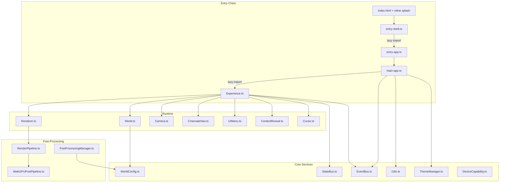

# Technical Audit Report — justlovejazz

**Date:** 2026-07-20  
**Auditor:** Z.ai Code  
**Scope:** Full codebase audit (all `src/` files, configuration, styles, tests, build)  
**Commit baseline:** `main`  
**Source of truth:** Current source, configuration and tests (per AGENTS.md).

---

## 1. Executive Summary

**Overall state:** The codebase is well-maintained, consistently typed, and demonstrates strong architectural discipline. It passes type-check, lint (0 errors), all 86 unit tests, and production build without issues. The project represents a sophisticated 3D portfolio with WebGPU/WebGL2 fallback, dual-path TSL post-processing, and a 6-section cinematic navigation system.

**Complexity level:** High — justified by the domain (WebGPU 3D portfolio with dual-backend rendering). The complexity is concentrated in the rendering pipeline and world management, not in unnecessary abstraction layers.

**Architectural consistency:** Good. The project follows a clear layered architecture (entry → router → Experience → World/UI), uses a single event system (EventBus), a unified animation state engine (StateBus), and consistent section-driven configuration (WorldConfig). Documentation is thorough and actively maintained.

**Main risks:**
- `Experience.ts` (1160 lines) and `World.ts` (956 lines) are large but coherent; their size is driven by the number of window event listeners and section-specific logic, not by deep nesting or God object patterns.
- BakuCarousel (522 lines) and WorksPlaneStage (288 lines) share significant fullscreen-transition and tap-detection logic that could diverge.
- The dual event system (typed EventBus + raw window CustomEvent) creates a maintenance contract that's easy to violate.

**Main sources of technical debt:**
- Dead no-op API methods on EnvSphere and WorksPortfolio.
- Duplicated sound-preference reading logic across 3 modules.
- 3347-line main.less with some inline magic values not yet extracted to tokens.
- Module-level side effects (texture loading in `works/scene.ts`).

**Readiness for further development:** High. The project has clear documentation, good test coverage on core modules, a structured contribution workflow (AGENTS.md), and an active NEXT.md backlog. New features can be added safely within the existing architecture.

---

## 2. Architecture Map

### 2.1 System Boundary



### 2.2 Key Dependencies

| Direction | From | To | Mechanism |
|-----------|------|----|-----------|
| Bootstrap | `entry-shell` | `entry-app` | Dynamic `import()` |
| Bootstrap | `entry-app` | `main-app` | Direct call `bootstrap()` |
| Bootstrap | `main-app` | `Experience` | Dynamic `import()` |
| Bootstrap | `main-app` | `UIManager` | Dynamic `import()` |
| Rendering | `Experience` | `Renderer` | Direct ownership |
| Rendering | `Experience` | `World` | Direct ownership |
| Events | `EventBus` | `window` | Automatic bridge (`emit()` dispatches `CustomEvent`) |
| Navigation | `router.ts` | `Experience` | `jlz:route-change` window event |
| Navigation | `CinematicNav` | `World` | Section index callback |
| Theme | `ContentReveal` | `Experience` | `jlz:theme-applied` window event |
| Animation | `StateBus` | `World/Section` | `tick()` in render loop |

### 2.3 State Sources

| Source | Type | Scope |
|--------|------|-------|
| `StateBus` | Animation state (number channels) | Global singleton |
| `ThemeManager` | `auto` / `inverse` mode | Global singleton (localStorage) |
| `i18n` | EN / RU language | Global singleton (localStorage) |
| `DeviceCapability` | Renderer mode, DPR, quality tier | Global singleton |
| `WorldConfig` | Per-phase camera, lighting, post, theme config | Pure data (read-only) |
| `CinematicNav` | Current section index, scroll progress | Instance (owned by Experience) |
| `EventBus` | Typed event dispatch | Global singleton |

### 2.4 Main Data Flow

```
User scroll/keyboard → CinematicNav.update() → section index
  → Experience reads index → World.updateTransform(ns) → cameraTarget + worldState
  → EventBus('jlz:section-change') → ContentReveal (theme) + NoiseText (title anim)
  → World.baku.rotateToFace(idx) → cube face rotation
  → PostProcessingManager.applyPreset() → bloom/grade/vignette crossfade
```

---

## 3. Critical Problems

| ID | Title | Severity | Confidence | Files | Description |
|----|-------|----------|------------|-------|-------------|
| C-1 | Module-level texture load in `works/scene.ts` | **High** | Confirmed | `src/sections/works/scene.ts:5-7` | `new THREE.TextureLoader().load(...)` runs at module evaluation time. If the file is imported before the DOM is ready (e.g., during server-side rendering or testing), this fails silently. The texture is also never disposed if the module is hot-reloaded (HMR re-evaluation creates a new texture, old one leaks GPU memory). |
| C-2 | IntersectionObserver leak in `entry-app.ts` | **Medium** | Confirmed | `src/entry-app.ts:262-275` | `setupTitleObserver()` creates an `IntersectionObserver` but never stores a reference for cleanup. On HMR teardown or SPA re-initialization, the observer continues observing detached DOM nodes. |
| C-3 | Dual event system contract fragility | **Medium** | High confidence | `src/core/EventBus.ts:54-64`, multiple consumers | EventBus bridges typed events to `window.dispatchEvent`. Consumers use either `eventBus.on()` or `window.addEventListener()`. This dual contract means new developers must inspect both paths. There is no compile-time enforcement that a consumer exists for every event, or vice versa. |

### C-1 Detail

**Scenario:** Module-level side effects are already documented as problematic in AGENTS.md (RULES.md: "Store and remove listeners, timers and GPU resources with their owner"). The `particleTexture` in `works/scene.ts` violates this: it's loaded at import time, has no owner, and `disposeSection3Textures()` exists as a module-level export but is only callable from `World.disposeSceneGroups()`.

**Minimal fix:** Move texture loading inside `createSection3()` so it's owned by the World lifecycle.

**Regression risk:** Low — the texture is only used by JunniParticles in the works scene group.

### C-2 Detail

**Scenario:** During HMR, `entry-app.ts` re-evaluates. `setupTitleObserver()` is called again from the `jlz:splash-entered` listener, creating a second observer on the same elements. The first observer is never disconnected.

**Minimal fix:** Store the observer reference on `entry-app.ts` module scope, disconnect in a cleanup function.

**Regression risk:** None — the observer only fires for `.studio-title` elements which are stable.

### C-3 Detail

**Scenario:** A developer adds a new event to `EventBus.AppEvents` but forgets to update a window listener that should react to it. Or removes a window listener that a typed handler depends on. The bridge in `emit()` masks this by silently working for both paths.

**Minimal fix:** This is an architectural choice, not a bug. The bridge is intentional (documented in EventBus.ts). The risk is mitigated by the typed `AppEvents` interface. Recommend: add a dev-only warning when `emit()` fires to window with no listeners (detectable via `getEventListeners` in Chrome, or a counter).

**Regression risk:** Medium — changing the event system affects every module in the project.

---

## 4. Overengineering and Unnecessary Complexity

| ID | Area | Current Approach | Why It's Complex | Simpler Solution | Benefit | Risk |
|----|------|-----------------|-------------------|------------------|--------|------|
| O-1 | `WorksPortfolio` | 62-line class with `group`, `projects`, `currentIdx`, `prev/next/goTo`, `onCardClick` callback. Group is `visible = false` — never rendered. | All input handling, spring physics, drag, expand/collapse, cube-rotation, texture-loading were already removed (documented in class comment). What remains is a thin callback router between DevPanel/overlay arrows and BakuCarousel. | Replace with a plain object `{ projects, currentIdx, onCardClick }` or inline the 3 methods directly into `Experience.ts`. | -62 lines, -1 class, -1 Three.js Group (never rendered) | Low — DevPanel accesses `portfolio.prev()/next()` |
| O-2 | `EnvSphere` no-op API | `setSectionColors()`, `setBlend()`, `attachToScene()` are documented no-ops with comments explaining they're kept for "API compat." | Dead methods that suggest functionality that doesn't exist. New developers may call them expecting behavior. | Remove the methods. `changeSection()` is the only active API. | -15 lines, clearer API surface | Very low — grepped zero callers beyond World.ts |
| O-3 | `EventBus` + `StateBus` overlap | Two separate pub/sub systems. EventBus for discrete lifecycle events. StateBus for continuous animation state with easing. | Both support `on/off/emit`. StateBus additionally supports named channels with numeric values and animation scheduling. The overlap is in the subscribe/notify pattern. | This is justified: EventBus is for discrete events (section change, route change), StateBus is for continuous numeric animation channels. They serve different purposes and shouldn't be merged. | N/A — keep as is | N/A |
| O-4 | `three-webgpu.d.ts` stub types | 50-line type declaration file with `{}` return types for WebGPU classes. | Three.js 0.184 has incomplete `.d.ts` for WebGPU APIs. The project works around this with `any` casts and `// eslint-disable` comments throughout TSL code. | This is justified — it's the minimum viable workaround for an upstream typing gap. Removing it would require `@ts-expect-error` on every TSL usage (worse). | N/A — keep as is | N/A |
| O-5 | `RenderPipeline` dual-path (830 lines) | WebGL2 path with 4-pass post (bright extract → blur ping-pong → composite). WebGPU path delegates to `WebGPUPostPipeline` (TSL node graph). | Two complete post-processing implementations that must produce visually identical output. | Justified by the WebGPU/WebGL2 fallback requirement. The WebGPU path uses TSL nodes (project's architectural rule), and WebGL2 needs raw GLSL. Removing either would lose a backend. | N/A — keep as is | N/A |

**Summary:** The project has remarkably little overengineering for its complexity level. The dead methods on EnvSphere and the hollowed-out WorksPortfolio are the only clear cases. The dual-path rendering, dual event system, and TSL type workarounds are all justified by real constraints.

---

## 5. Duplication and Lack of Unification

### 5.1 Architectural Approaches

| Issue | Locations | Recommendation |
|-------|-----------|----------------|
| Dual event consumption | `eventBus.on('jlz:section-change', ...)` in Experience.ts vs `window.addEventListener('jlz:section-change', ...)` in ContentReveal.ts | Accept the bridge as intentional (documented). Ensure all NEW events use `eventBus.on()` for typed consumers. |
| Sound preference reading | `entry-app.ts:83-85`, `UIMenu.ts:19-20`, `Experience.ts:450-453` | Extract to a single `getSoundPreference(): boolean` in a shared location (e.g., `SfxSystem.ts` or a new `preferences.ts`). |

### 5.2 Components

| Issue | Locations | Recommendation |
|-------|-----------|----------------|
| BakuCarousel ↔ WorksPlaneStage fullscreen transition | `BakuCarousel.beginFullscreenTransition()` (522-line file, ~60 lines) and `WorksPlaneStage.openProject()` (288-line file, ~30 lines) | Both implement: (1) opening state tracking, (2) camera position/direction extraction, (3) fullscreen scale calculation, (4) smoothstep interpolation, (5) handoff callback at `OVERLAY_TAKEOVER` threshold. Extract a shared `FullscreenTransition` helper or align the two implementations. However, they differ in scope (carousel card vs. 3D plane), so a full merge may not be appropriate. |
| Error display HTML | `index.html:586-589` (inline script) and `entry-app.ts:95-101` (showLoadError) | The 60s timeout in index.html duplicates the error HTML from entry-app.ts. The entry-app.ts version is the canonical one (triggered by `jlz:webgl-failed`). The index.html version is a safety net. Accept the duplication — it's a fallback for a scenario where entry-app.ts itself failed to load. |

### 5.3 State

| Issue | Locations | Recommendation |
|-------|-----------|----------------|
| `currentSectionIndex` tracked in multiple places | `World.currentSectionIndex`, `Experience._prevSectionIndex`, `ContentReveal.currentSectionIndex` | World is the source of truth. Experience and ContentReveal read it via events. This is correct event-driven design — no unification needed. |

### 5.4 Styles

| Issue | Locations | Recommendation |
|-------|-----------|----------------|
| Color values in index.html inline CSS vs. Less tokens | `index.html:161` (`#050507`), `index.html:196` (`#050507`), vs. `console-theme/_import.less` (`@jlz-color-bg`) | The inline CSS in index.html intentionally duplicates the background color to prevent white flash before CSS loads. This is justified — it's a performance optimization, not duplication. |

---

## 6. Components for Merging or Reuse

| Candidate | Existing Implementations | Common Part | Differences | Proposed API | Expected Reduction | New Complexity |
|-----------|--------------------------|-------------|------------|--------------|--------------------|----|
| BakuCarousel ↔ WorksPlaneStage transition | Both have opening state, camera extraction, smoothstep interpolation, takeover threshold | ~70% overlap in transition logic | BakuCarousel has momentum/drag, WorksPlaneStage has section-based layout | Extract `computeFullscreenScale(camera, aspect)` and `smoothstepTransition(elapsed, duration)` as shared utilities | ~30 lines deduplication | Low — pure functions |
| Section templates | 5 content pages (services, works, manifesto, lab, contact) all use `sectionShell()` + `contentTop()` | Identical shell structure | Different content (cards, descriptions, forms) | Already unified via `sectionShell()` and `contentTop()` — no further action needed | N/A | N/A |

**Assessment:** The component layer is well-unified. The shared `sectionShell()`, `contentTop()`, `storyBottom()` helpers prevent template duplication effectively. The BakuCarousel/WorksPlaneStage overlap is the only meaningful candidate, and it's bounded.

---

## 7. Potential Bugs

### 7.1 Confirmed

| ID | Description | File:Line | Scenario | Fix |
|----|-------------|-----------|----------|-----|
| B-1 | Module-level texture load (no owner, no HMR cleanup) | `sections/works/scene.ts:5-7` | HMR re-evaluation leaks GPU texture | Move inside `createSection3()` |
| B-2 | IntersectionObserver never disconnected | `entry-app.ts:262-275` | HMR creates duplicate observers | Store ref, add disconnect |
| B-3 | `error.showLoadError()` replaces `innerHTML` of parent — if called twice, second call finds no `enterBtn` | `entry-app.ts:95` | If `jlz:webgl-failed` fires after `showLoadError` already ran, no harm (guard `if (!enterBtn) return`). But the 60s timeout in index.html could fire AFTER entry-app's `showLoadError`, replacing the retry link with nothing useful. | Add guard in index.html: check if `enterBtn.parentElement` still contains the original button before replacing. |

### 7.2 High-Probability

| ID | Description | File:Line | Scenario | Verification |
|----|-------------|-----------|----------|-------------|
| B-4 | `World.ts` has 956 lines with `updateTransform()` computing GC-free pooled vectors per frame. If any code path reads `cameraTarget` or `worldState` after `updateTransform` but before the next `update()`, it gets stale data. | `World.ts:~500-700` | Race between CinematicNav and World in the same frame | Trace cameraTarget usage — currently only Experience.update() consumes it immediately after `updateTransform()`, so no race. Low risk. |
| B-5 | `SplashCube` jelly geometry update at 30fps cadence (`JELLY_UPDATE_INTERVAL = 1/30`). If `dt` is very small (high-refresh monitors), multiple `update()` calls could skip jelly frames. | `SplashCube.ts:~30` | 240Hz monitor with 4ms frame time | By design — jelly is a subtle visual effect, not critical. Acceptable. |

### 7.3 Requiring Runtime Verification

| ID | Description | Verification Method |
|----|-------------|-------------------|
| B-6 | WebGPU device-lost recovery — `Renderer.ts` only logs in DEV mode. In production, the render loop continues with a lost device, potentially crashing. | Trigger WebGPU device loss in Chrome DevTools (not easily automatable). Add a `device-lost` listener that pauses the render loop and shows a recovery UI. |
| B-7 | `BakuCarousel` velocity-based momentum after drag release could cause the stream to drift indefinitely if `MOMENTUM_DECAY (0.84)` is too slow to converge. | Drag rapidly and release — observe if stream settles within 2-3 seconds. Current decay appears correct (0.84^60 ≈ 0.0000, converges in ~60 frames). |

---

## 8. UI/UX and Styles

### 8.1 Visual Consistency

**Strengths:**
- Centralized design tokens in `console-theme/_import.less` — all colors, typography, spacing, radii, z-index, motion durations are `@jlz-*` variables.
- CSS custom properties (`:root { --jlz-* }`) mirror the Less variables for runtime access.
- Consistent use of `uk-heading-xlarge`, `uk-heading-large`, `uk-heading-medium` for typographic hierarchy.
- `Onest Variable` font with `wght` axis animation for interactive text.

**Issues:**
| ID | Issue | Location | Recommendation |
|----|-------|----------|----------------|
| U-1 | `main.less` is 3347 lines — difficult to navigate. Some rules are deeply nested (4-5 levels). | `src/assets/main.less` | Consider splitting into logical files: `sections.less`, `overlay.less`, `topbar.less`, `menu.less`, `works.less`, `cursor.less`. Import from `_import.less`. |
| U-2 | Magic numbers in index.html inline CSS: `z-index: 30000`, `z-index: 10016`, `z-index: 10015`, `z-index: 10014`, `z-index: 10012`, `z-index: 10011` | `index.html:192-315` | These are intentionally high to layer above UIkit. Document them with comments (some already have comments). Not a bug — just high values. |
| U-3 | Some `clamp()` values in Less don't align with breakpoints | `main.less` (various) | Minor — clamp is fluid by design, breakpoints are for discrete layout changes. |

### 8.2 Interactive States

**Assessment: Good.**
- Hover: cursor noise expansion + fill (Canvas 2D) ✓
- Focus: `focus-visible` on skip link ✓
- Active: click bump animation ✓
- Disabled: Enter button `pointer-events: none` until ready ✓
- Loading: progress ring SVG ✓
- Error: load error with retry link ✓
- Selected: `.section-active` class ✓
- Reduced motion: `prefers-reduced-motion: reduce` respected throughout ✓

**Missing:**
- No explicit `:focus-visible` styling on work cards or menu items (relies on browser default).
- No `aria-busy` on the app container during initial load.

### 8.3 Responsiveness

**Strengths:**
- Mobile-first design with `@m` (960px) breakpoint mirroring UIkit grid.
- WorksPlaneStage switches between `WIDE_LAYOUT` and `STACKED_LAYOUT` at 960px.
- Custom cursor hidden on touch devices via CSS `@media (pointer: coarse)`.
- `100dvh` used correctly for mobile viewport height.
- Safe area support via `viewport-fit=cover` meta tag.

**Issues:**
| ID | Issue | Location | Recommendation |
|----|-------|----------|----------------|
| U-4 | CinematicNav (dotnav rail) may overlap with content on very short viewports (< 500px) | `CinematicNav.ts` | Test on 320px viewport height. The rail is positioned at the bottom of the console bar — verify it doesn't obscure content. |

### 8.4 Accessibility

**Strengths:**
- Skip link (`<a class="skip-link">`) targeting `#section-intro` ✓
- `aria-label` on Enter button, config buttons, work cards ✓
- `aria-pressed` on theme toggle and sound toggle ✓
- `role="main"` on `#spa-content` ✓
- `aria-live="polite"` on splash loader ✓
- `aria-hidden="true"` on decorative SVG elements ✓
- `hidden` attribute on accessible works title (visible to screen readers) ✓

**Issues:**
| ID | Issue | Location | Recommendation |
|----|-------|----------|----------------|
| U-5 | No focus trap in fullscreen overlay (project detail or showreel) | `FullscreenOverlay.ts` | When the overlay opens, Tab key can escape to elements behind it. Add a focus trap (`focusin` event listener). |
| U-6 | `aria-expanded` on menu launcher and contact launcher is never updated | `UIMenu.ts:143-144` | The `aria-expanded` attribute stays `"false"` even when the menu/contact sheet is open. Update it when sheets open/close. |

### 8.5 CSS Architecture

**Strengths:**
- Single Less import chain: `_theme.less` → `_import.less` → UIkit components.
- Console theme variables are the single source of truth.
- Blog styles properly separated into `blog.less`.
- `!important` usage is minimal and justified (UIkit overrides).

**Issues:**
| ID | Issue | Location | Recommendation |
|----|-------|----------|----------------|
| U-7 | `main.less` has inline `@media` queries scattered throughout rather than grouped at the bottom | Various | Consider collecting responsive overrides at the end of each section, or in a dedicated `responsive.less` file. This is a style preference, not a bug. |

### 8.6 Design Tokens Map

| Category | Source | Status |
|----------|--------|--------|
| Colors | `console-theme/_import.less` | ✅ Centralized |
| Typography | `_import.less` (`@jlz-font-*`) | ✅ Centralized |
| Spacing | `_import.less` (`@jlz-space-*`) | ✅ Centralized |
| Radii | `_import.less` (`@jlz-radius-*`) | ✅ Centralized |
| Shadows | `_import.less` (`@jlz-shadow-*`) | ✅ Centralized |
| Z-index | `_import.less` (`@jlz-z-*`) | ✅ Centralized (but splash uses raw numbers) |
| Durations | `_import.less` (`@jlz-duration-*`) | ✅ Centralized |
| Easings | `_import.less` (`@jlz-ease-*`) | ✅ Centralized |
| Breakpoints | Inherited from UIkit (`@s`, `@m`, `@l`, `@xl`) | ✅ Standard |

---

## 9. Performance

### 9.1 Initial Load

| Metric | Budget | Actual | Status |
|--------|--------|--------|--------|
| Splash JS (before Three.js) | ≤ 5 KB gzip | 1.9 KB gzip (index + runtime) | ✅ |
| Three.js delivery | ≤ 350 KB gzip | 332 KB gzip (lazy) | ✅ |
| CSS | N/A | 21.58 KB gzip (blog) + app CSS (inline) | ✅ |

**Chunk analysis (production build):**
- `vendor-three`: 1,229 KB / 332 KB gzip — expected and within budget
- `vendor-ui`: 223 KB / 75.8 KB gzip — UIkit 3
- `chunk-core-world`: 68.5 KB / 21.6 KB gzip — World.ts + sections
- `chunk-experience`: 62.5 KB / 16.6 KB gzip — Experience.ts
- `chunk-core`: 50.2 KB / 15.2 KB gzip — Core services
- `entry-app`: 29.5 KB / 8.4 KB gzip — App bootstrap

### 9.2 Runtime

**On-demand rendering:** The render loop only draws when something is actively changing (navigation, carousel, particles, cursor, ambient breathing). This is well-implemented with 13 activity flags checked per frame.

**FPS tracking:** O(1) circular buffer (PERF-7 fix) — no array.shift() or reduce() per frame.

**Auto-reduce:** When FPS < 30 sustained over 60 frames, JunniParticles count is halved (one-way, no restore to avoid GPU spike re-trigger).

**Ambient breathing:** Single render frame every 2.5s when fully idle — prevents the scene from looking frozen without burning GPU.

### 9.3 Memory

| Concern | Assessment |
|---------|------------|
| Texture disposal | ✅ Deep material disposal utility (`disposeMaterialDeep`). CasePlane shares one material, textures disposed in BakuCarousel/WorksPlaneStage cleanup. |
| Event listener cleanup | ✅ Experience.destroy() removes all 14+ window listeners. Cursor, Input, Sizes, CinematicNav all have destroy(). |
| GPU resource disposal | ✅ World.dispose() traverses and disposes geometries, materials, textures. Renderer disposes pipeline and canvas. |
| Timer cleanup | ✅ Camera._pulseTimer cleared in destroy(). BakuCarousel.snapTimer cleared in dispose(). |
| Singleton cleanup | ⚠️ `Input.instance` and `Experience.instance` are cleared in destroy() but `StateBus.instance` is not. Acceptable — StateBus has no GPU/DOM resources. |

### 9.4 Mobile

- DPR capped at 1.5 for both WebGPU and WebGL2 (prevents post-processing from missing v-sync on high-refresh panels).
- EnvSphere canvas reduced from 2048×1024 to 1024×512 (documented Safari/iOS perf fix).
- Jelly geometry update throttled to 30fps cadence.
- Canvas cursor redraw only when values change (PERF-3 fix).
- Text particle texture has mipmaps disabled (R-3 fix — prevents frame-bleeding on sprite sheets).

---

## 10. What Should Be Deleted

| Item | Evidence | Verification |
|------|----------|-------------|
| `WorksPortfolio.group` (Three.js Group, never rendered) | `WorksPortfolio.ts:30`: `this.group.visible = false`. Only added to World for DevPanel compatibility. | Check if DevPanel accesses `portfolio.group` — if not, remove the group entirely and keep only the plain object. |
| `EnvSphere.setSectionColors()` | No-op with comment "No-op — patterns are fixed per section". | `rg 'setSectionColors' src/` — only called in World.ts, which passes the result to this no-op. |
| `EnvSphere.setBlend()` | No-op with comment "No-op — section weights drive the blend now". | `rg 'setBlend' src/` — zero callers found. |
| `EnvSphere.attachToScene()` | No-op with comment "No-op — mesh is visible, renders itself." | `rg 'attachToScene' src/` — only called in old World.ts code, now a no-op. |
| `references/` directory | 8MB+ of reference code from next.junni.co.jp. Intentional reference per AGENTS.md. | Keep — documented as reference material. |
| `SplashCube` dead comments | Multiple removed-code comments: `// (PlayButton3D removed — dead render path deleted)`, `// (CubeCamera + contentScene REMOVED)` | These are useful historical context. Keep or clean up in a dedicated maintenance pass. |

---

## 11. What Should NOT Be Refactored

| Area | Why It Looks Complex | Why It's Justified |
|-------|----------------------|---------------------|
| `RenderPipeline.ts` (830 lines) | Two complete post-processing implementations in one file | WebGPU and WebGL2 need different approaches (TSL nodes vs. raw GLSL). Merging them would require conditional logic that's harder to understand than two separate paths. |
| `Experience.ts` (1160 lines) | Largest file, 14+ private event handler fields | The handlers are all cleanup-tracked (set in init, removed in destroy). The file's size comes from the number of integration points, not from nested complexity. Splitting would require passing `Experience` references between modules. |
| `World.ts` (956 lines) | Manages 6 sections, carousel, ground plane, theme sync | Each section has different behavior (particles, carousel, typography, contact form). The per-section logic is already delegated to `SectionSceneFactory` and individual section files. World coordinates them. |
| `WorldConfig.ts` (583 lines) | Large configuration objects with many numeric properties | This is data, not logic. It's the single source of truth for all section parameters. Splitting it would make it harder to see the full picture. |
| `BakuCarousel.ts` (522 lines) | Complex drag, momentum, morph, fullscreen transition | This is the most interactive component in the project — it handles pointer events, physics, 3D transforms, and DOM handoff. Its complexity is proportional to its feature set. |
| `EventBus` → `window` bridge | Dual event system seems redundant | Intentional design: typed events for new code, window events for UIkit integration and legacy listeners. The bridge is 6 lines of code. Removing it would force all consumers to use one system. |
| `i18n.ts` (645 lines) | Large translation dictionary | This is pure data (EN/RU string pairs). The dictionary must be in one place for language parity verification. The code (init/toggle/apply) is only ~100 lines; the rest is the dictionary itself. |
| TSL `any` casts in JunniParticles | ~20 `any` casts and `// eslint-disable` comments | Three.js 0.184 has incomplete `.d.ts` for TSL. The casts are the minimum viable workaround. Upstream typing improvement would eliminate them. |

---

## 12. Target Simplified Architecture

### What to Keep

```
src/
  entry-shell.ts          ← minimal, unchanged
  entry-app.ts            ← unchanged (splash + bootstrap)
  main-app.ts             ← unchanged (lazy 3D boot)
  router.ts               ← unchanged
  core/
    EventBus.ts           ← keep (typed events + window bridge)
    StateBus.ts           ← keep (animation channels)
    ThemeManager.ts      ← keep
    i18n.ts               ← keep
    pageMeta.ts           ← keep
    WorldConfig.ts        ← keep (data file)
    World.ts              ← keep (section coordinator)
    Section.ts            ← keep
    SectionSceneFactory.ts ← keep
    DeviceCapability.ts   ← keep
    RenderPipeline.ts     ← keep (dual backend)
    WebGPUPostPipeline.ts ← keep
    PostProcessingManager.ts ← keep
    ErrorTracker.ts       ← keep
    motionPolicy.ts       ← keep
    SfxSystem.ts          ← keep
    DevPanel.ts           ← keep
  Experience/
    Experience.ts         ← keep (integration point)
    Renderer.ts           ← keep
    Camera.ts             ← keep
    Cursor.ts             ← keep
    Input.ts              ← keep
    Time.ts               ← keep
    Sizes.ts              ← keep
    NoiseText.ts          ← keep
    BlurFade.ts           ← keep
    ContentReveal.ts      ← keep
    WorksPortfolio.ts     ← simplify (remove Three.js Group)
    World/                ← keep all
  UI/
    UIManager.ts          ← keep
    UIMenu.ts             ← keep
    CinematicNav.ts       ← keep
    FullscreenOverlay.ts  ← keep (add focus trap)
    WorkCards.ts          ← keep
  sections/              ← keep all
  pages/                 ← keep all
  Data/                  ← keep
  Utils/                 ← keep
  assets/                ← keep (consider splitting main.less)
  types/                 ← keep
  __tests__/             ← keep
```

### What to Merge

- **Sound preference reading:** Extract `getSoundMuted(): boolean` to a shared location. Remove duplication from 3 modules.
- **Fullscreen transition math:** Extract `computeFullscreenScale()` and `smoothstepTakeover()` from BakuCarousel/WorksPlaneStage to a shared utility.

### What to Remove

- EnvSphere no-op methods (`setSectionColors`, `setBlend`, `attachToScene`).
- WorksPortfolio Three.js Group (keep only the plain data + callback object).
- IntersectionObserver leak in `entry-app.ts` (add cleanup).

### What to Unify

- **Event consumption pattern:** New events MUST use `eventBus.on()`. Window listeners are acceptable ONLY for UIkit integration points that can't use the typed bus.
- **CSS file organization:** Split `main.less` into logical sub-files imported from `_import.less`.

---

## 13. Refactoring Plan

### Etap A — Safe Quick Improvements (Low Risk)

| Task | Files | Verification |
|------|-------|-------------|
| A-1: Remove EnvSphere no-op methods | `EnvSphere.ts` | `bun run type-check && bun run lint && bun run test:unit` |
| A-2: Simplify WorksPortfolio (remove Group) | `WorksPortfolio.ts`, `Experience.ts` | `bun run type-check && bun run lint && bun run test:unit` |
| A-3: Fix IntersectionObserver leak | `entry-app.ts` | Manual: HMR twice, verify no duplicate observers in DevTools |
| A-4: Extract shared sound preference | New `preferences.ts` or add to `SfxSystem.ts`; update `entry-app.ts`, `UIMenu.ts`, `Experience.ts` | `bun run type-check && bun run test:unit` |
| A-5: Fix index.html 60s timeout guard | `index.html:584-592` | Verify: disable Three.js import, confirm fallback still shows retry link |
| A-6: Add `aria-expanded` update to menu/contact launchers | `UIMenu.ts` | Manual: open menu, verify `aria-expanded="true"` |
| A-7: Add focus trap to FullscreenOverlay | `FullscreenOverlay.ts` | Manual: open overlay, Tab key should stay trapped |

### Etap B — Structural Simplification (Medium Risk)

| Task | Files | Dependencies | Verification |
|------|-------|-------------|-------------|
| B-1: Extract fullscreen transition utilities | New `Utils/fullscreenTransition.ts`; update `BakuCarousel.ts`, `WorksPlaneStage.ts` | A-2 | `bun run type-check && bun run lint` |
| B-2: Split main.less into sub-files | New `assets/sections.less`, `assets/overlay.less`, etc.; update `_import.less` | None | Visual: no layout changes; `bun run build` |
| B-3: Unify event consumption pattern (document + lint rule) | `EventBus.ts`, AGENTS.md, `eslint.config.js` | None | `bun run lint` (new warnings for window listeners on typed events) |
| B-4: Move module-level texture load into createSection3 | `sections/works/scene.ts` | None | `bun run type-check && bun run test:unit` |

### Etap C — UI and Performance (Low-Medium Risk)

| Task | Files | Dependencies | Verification |
|------|-------|-------------|-------------|
| C-1: Add WebGPU device-lost recovery UI | `Renderer.ts`, new `device-lost` overlay | None | Manual: Chrome DevTools device-lost trigger |
| C-2: Verify CinematicNav on 320px viewport | `CinematicNav.ts` | None | Manual: Browser DevTools responsive mode |
| C-3: Add `aria-busy` to app container during load | `index.html`, `entry-app.ts` | None | Manual: screen reader announces "loading" |

### Etap D — Architectural Changes (Higher Risk, Only If Needed)

| Task | When | Verification |
|------|------|-------------|
| D-1: Merge StateBus into EventBus (if StateBus usage grows) | Only if a third consumer pattern emerges | Full regression test suite |
| D-2: Extract World.ts section-specific logic into dedicated SectionCoordinator | Only if World.ts exceeds 1200 lines | Full regression test suite |

---

## 14. Priority Backlog

| Priority | Task | Reason | User Effect | Technical Effect | Complexity | Risk |
|----------|------|--------|-------------|-----------------|------------|------|
| **P1** | A-3: Fix IntersectionObserver leak | Memory leak on every HMR cycle (dev experience degradation) | N/A (dev-only) | Eliminates observer accumulation | Low | Low |
| **P1** | A-5: Fix index.html 60s timeout guard | Safety net could replace error UI with empty content | User sees "3D Failed" twice or loses retry option | Robustness | Low | Low |
| **P1** | A-6: Update `aria-expanded` on sheets | Screen readers announce incorrect state | Accessible menu/contact state | Compliance | Low | Low |
| **P2** | A-1: Remove EnvSphere no-op methods | Dead API misleads developers | N/A | Clearer API surface | Low | Very low |
| **P2** | A-2: Simplify WorksPortfolio | Dead Three.js Group wastes scene graph traversal | N/A | -62 lines, -1 class | Low | Low |
| **P2** | A-4: Extract shared sound preference | Triple-read of same localStorage key | N/A | Single source of truth | Low | Low |
| **P2** | A-7: Add focus trap to overlay | Tab key escapes overlay, breaks keyboard workflow | Accessible overlay navigation | Compliance | Medium | Low |
| **P2** | B-4: Move module-level texture load | GPU texture leak on HMR; inconsistent with project's ownership rule | N/A | Proper lifecycle | Low | Low |
| **P2** | C-1: WebGPU device-lost recovery | Render loop crashes silently after device loss | Graceful degradation | Robustness | Medium | Medium |
| **P3** | B-1: Extract fullscreen transition utilities | Duplicated transition logic in 2 files | N/A | -30 lines, reduced divergence | Medium | Low |
| **P3** | B-2: Split main.less | 3347-line file is hard to navigate | N/A | Maintainability | Low | Very low |
| **P3** | B-3: Unify event consumption pattern | Dual event system creates maintenance contract | N/A | Clearer event flow | Medium | Medium |
| **P3** | C-2: Verify CinematicNav on small viewports | Possible overlap on < 500px height | Consistent mobile layout | Robustness | Low | Very low |

---

## Appendix: Verification Results

| Check | Result |
|-------|--------|
| `bun run type-check` | ✅ 0 errors |
| `bun run lint` | ✅ 0 errors, 54 warnings (all `any`-related at TSL/WebGPU boundaries) |
| `bun run test:unit` | ✅ 86/86 tests passing (8 test files) |
| `bun run build` | ✅ Production build successful (2.18s) |
| Entry JS (splash) | ✅ 1.9 KB gzip (within 5 KB budget) |
| Three.js (lazy) | ✅ 332 KB gzip (within 350 KB budget) |
| Total source (TS) | 15,055 lines |
| Total source (Less) | 4,296 lines |
| Total source | 19,351 lines |
| Test files | 8 (86 tests) |
| Documentation files | 10 (AGENTS.md, ARCHITECTURE.md, RULES.md, DEVELOPMENT.md, UIKIT3.md, BRAND.md, CHANGELOG.md, README.md, WORKLOG.md, NEXT.md) |